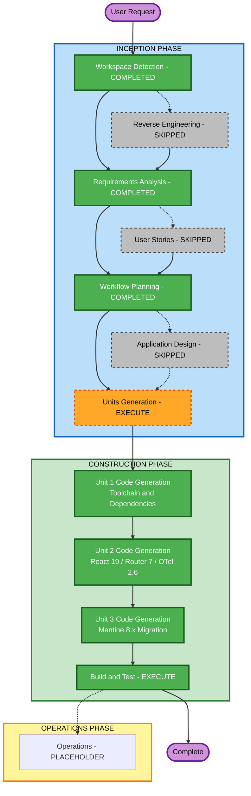

# Execution Plan  Vite Migration Cycle

## Detailed Analysis Summary

### Transformation Scope
- **Transformation Type**: Toolchain + multi-framework major-version migration (brownfield)
- **Primary Changes**: Build tool replacement (react-scripts  Vite/Vitest), dependency major-version upgrades
- **Related Components**: All source files, package.json, tsconfig.json, Dockerfile, public/index.html, setupProxy files

### Change Impact Assessment
- **User-facing changes**: No (UI preserved, routing behavior preserved)
- **Structural changes**: Yes  build entry point, env-var prefix, proxy configuration
- **Data model changes**: No
- **API changes**: Yes  React Router 7 import paths, Mantine 8.x component API, React 19 patterns, OTel 2.6 API
- **NFR impact**: Yes  build speed improved, testability improved with Vitest

### Risk Assessment
- **Risk Level**: Medium-High
- **Rationale**: Three simultaneous major-version library upgrades plus full toolchain swap. Each is proven independently but the combination requires careful ordering and validation.
- **Rollback Complexity**: Moderate (git revert, npm install)
- **Testing Complexity**: Moderate (type-check + vitest + build as gate)

---

## Stage Execution Decisions

| Stage | Decision | Reason |
|-------|----------|--------|
| Workspace Detection | COMPLETED | Existing project confirmed |
| Reverse Engineering | SKIPPED | Artifacts exist from prior cycle |
| Requirements Analysis | COMPLETED | This cycle |
| User Stories | SKIPPED | Pure technical migration, no user-facing changes |
| Workflow Planning | IN PROGRESS | This document |
| Application Design | SKIPPED | No new components or architecture |
| Units Generation | EXECUTE | 3 units with distinct concerns need definition |
| Functional Design (all units) | SKIPPED | No new business logic |
| NFR Requirements (all units) | SKIPPED | NFRs fully captured in requirements document |
| NFR Design (all units) | SKIPPED | No new patterns to design |
| Infrastructure Design (all units) | SKIPPED | No infrastructure changes |
| Code Generation (per unit) | EXECUTE | Core delivery stage |
| Build and Test | EXECUTE | Validation gate required |

---

## Proposed Unit Breakdown

### Unit 1  Toolchain & Dependencies
**Scope**: Replace build/test toolchain and update all dependency versions

Deliverables:
- package.json: all dependency version pins (React 19.2, Mantine 8.3 family, React Router 7, OTel 2.6, etc.), react-scripts removed, Vite/Vitest added
- .npmrc: legacy-peer-deps removed
- package.json: installConfig.legacyPeerDeps removed, scripts updated to Vite/Vitest commands
- vite.config.ts: dev server, proxy (replacing setupProxy.js), build config
- vitest.config.ts (or inline in vite.config.ts): Vitest setup
- index.html: updated to Vite entry point expectations (root-level, script type=module)
- tsconfig.json: updated for Vite/Vitest compatibility
- setupProxy.js/ts: removed (proxy moved to Vite config)

### Unit 2  Application Code Migration
**Scope**: Update source code for React 19, React Router 7, and OpenTelemetry 2.6 breaking changes

Deliverables:
- All routing files: react-router-dom imports migrated to react-router
- React 19 API updates across components (ref patterns, act() etc.)
- OpenTelemetry 2.6 API updates in Tracing.ts and CustomTracing.ts
- Test setup files updated for Vitest (setupTests.ts, App.test.tsx)
- Any env-var references: REACT_APP_*  VITE_*

### Unit 3  Mantine 8.x Migration
**Scope**: Update all Mantine component usage from 7.x API to 8.x API

Deliverables:
- All components using Mantine updated to 8.x API
- Theme/provider changes
- Deprecated props/components replaced
- Dockerfile build stage verified and updated if needed
- README.md updated with new commands

---

## Workflow Visualization

### Mermaid Diagram



### Text Alternative

```
INCEPTION PHASE
  - Workspace Detection: COMPLETED
  - Reverse Engineering: SKIPPED (artifacts present)
  - Requirements Analysis: COMPLETED
  - User Stories: SKIPPED (no user-facing changes)
  - Workflow Planning: COMPLETED
  - Application Design: SKIPPED (no new components)
  - Units Generation: EXECUTE

CONSTRUCTION PHASE
  - Unit 1 Code Generation: Toolchain and Dependencies  [EXECUTE]
  - Unit 2 Code Generation: React 19 / Router 7 / OTel 2.6  [EXECUTE]
  - Unit 3 Code Generation: Mantine 8.x Migration  [EXECUTE]
  - Build and Test  [EXECUTE]

OPERATIONS PHASE
  - Operations: PLACEHOLDER
```

---

## Execution Notes

- **Sequential**: Units execute in strict order (1  2  3) due to dependency chain
- **Validation gate**: After all units, Build and Test must pass: npm install (clean) + type-check + vitest + vite build
- **Breaking change priority**: React Router 7 and Mantine 8 carry the most code-change volume
- **Compatibility pinning**: Versions will be verified for mutual compatibility before Unit 1 generation

---

## Extension Compliance (Workflow Planning Stage)

- security-baseline: N/A (disabled for this cycle)
