# Execution Plan

## Detailed Analysis Summary

### Project Context
- **Project Type**: Brownfield React SPA
- **Package Structure**: Single-package application (no multi-module dependencies)
- **Total Source Files**: 52 files (23 React components, 6 services, 3 data files, configuration)
- **Current Technology Stack**: React 18.3.1, Mantine v6.0.18, JavaScript
- **Target Technology Stack**: Latest React, Mantine v7.x, TypeScript strict mode

### Transformation Scope
- **Transformation Type**: Technical Modernization (not architectural transformation)
- **Primary Changes**:
  - Dependency updates (all 22 direct dependencies to latest versions)
  - UI framework major version upgrade (Mantine v6 → v7)
  - Language migration (JavaScript → TypeScript with strict mode)
  - Peer dependency conflict resolution
- **Related Components**: All 52 source files affected by TypeScript conversion
- **Architecture Changes**: None - maintaining existing SPA architecture
- **Infrastructure Changes**: None - maintaining Docker + NGINX deployment model

### Change Impact Assessment

**User-facing changes**: ❌ NO
- Explicit requirement: UI must remain visually identical
- No new features or functionality
- Same user workflows and interactions
- Constraint: No component removal unless required by migration

**Structural changes**: ❌ NO
- Same React SPA architecture
- Same routing structure (React Router v6)
- Same component hierarchy and organization
- Same state management pattern (Context API)

**Data model changes**: ❌ NO
- Same cart data structure in localStorage
- Same API request/response formats
- Same internal data flow patterns
- TypeScript types will document existing structures

**API changes**: ❌ NO
- Backend API endpoints unchanged
- API client methods remain compatible
- Request/response contracts preserved
- OpenTelemetry trace format maintained

**NFR impact**: ✅ YES
- **Performance**: Bundle size concerns with TypeScript + Mantine v7
- **Backwards Compatibility**: External API compatibility required
- **Code Quality**: TypeScript strict mode improves type safety
- **Build Reliability**: Peer dependency resolution critical
- **Developer Experience**: Type safety and IDE support improvements

### Component Relationships

**Primary Component**: FlyFast-WebUI (Single React SPA)

**No multi-package dependencies** - This is a single-package application with:
- **Direct Changes**: All 52 source files (TypeScript conversion)
- **Framework Migration**: All components using Mantine (v6 → v7)
- **Type Definitions**: All services, components, utilities need types
- **Configuration Updates**: Build system, Docker, documentation

**External Dependencies**:
- **Backend API**: Flight Search service (port 8080) - NO CHANGES
- **OpenTelemetry Collector**: Trace collection (port 55681) - NO CHANGES
- **Runtime Environment**: Browser environment - NO CHANGES

### Risk Assessment

**Risk Level**: 🟡 MEDIUM-HIGH

**Risk Factors**:
1. **Mantine v7 Breaking Changes**: Major version upgrade with API changes
2. **TypeScript Conversion Scale**: 52 files to convert with strict mode
3. **No Test Safety Net**: <5% test coverage, visual verification only
4. **Peer Dependency Complexity**: Must eliminate --legacy-peer-deps flag
5. **UI Preservation Constraint**: Must maintain exact visual appearance

**Rollback Complexity**: 🟢 EASY
- Single package with git version control
- No database migrations or data structure changes
- No external API contract changes
- Docker image can be reverted easily

**Testing Complexity**: 🟡 MODERATE
- No automated tests available
- Manual visual verification required for all UI components
- 5 core user flows to verify
- Build and deployment verification required

**Mitigation Strategies**:
1. Break work into sequential units (dependencies → TypeScript → Mantine)
2. Comprehensive NFR assessment before code generation
3. Detailed Mantine migration guide analysis
4. Incremental file conversion with compilation checks
5. Visual testing checkpoints after each unit

---

## Workflow Visualization

```mermaid
flowchart TD
    Start(["🎯 User Request:<br/>Update Dependencies"])
    
    subgraph INCEPTION["🔵 INCEPTION PHASE"]
        direction TB
        WD["Workspace Detection<br/><b>✅ COMPLETED</b>"]
        RE["Reverse Engineering<br/><b>✅ COMPLETED</b>"]
        RA["Requirements Analysis<br/><b>✅ COMPLETED</b>"]
        US["User Stories<br/><b>⏭️ SKIPPED</b><br/><i>Technical upgrade only</i>"]
        WP["Workflow Planning<br/><b>🔄 IN PROGRESS</b>"]
        AD["Application Design<br/><b>⏭️ SKIP</b><br/><i>No new components</i>"]
        UG["Units Generation<br/><b>▶️ EXECUTE</b><br/><i>3 units defined</i>"]
    end
    
    subgraph CONSTRUCTION["🟢 CONSTRUCTION PHASE"]
        direction TB
        
        subgraph UNIT1["📦 Unit 1: Dependencies & Config"]
            FD1["Functional Design<br/><b>⏭️ SKIP</b>"]
            NFR1["NFR Requirements<br/><b>▶️ EXECUTE</b>"]
            NFRD1["NFR Design<br/><b>▶️ EXECUTE</b>"]
            ID1["Infrastructure Design<br/><b>⏭️ SKIP</b>"]
            CP1["Code Planning<br/><b>▶️ EXECUTE</b>"]
            CG1["Code Generation<br/><b>▶️ EXECUTE</b>"]
        end
        
        subgraph UNIT2["📦 Unit 2: TypeScript Conversion"]
            FD2["Functional Design<br/><b>⏭️ SKIP</b>"]
            NFR2["NFR Requirements<br/><b>▶️ EXECUTE</b>"]
            NFRD2["NFR Design<br/><b>▶️ EXECUTE</b>"]
            ID2["Infrastructure Design<br/><b>⏭️ SKIP</b>"]
            CP2["Code Planning<br/><b>▶️ EXECUTE</b>"]
            CG2["Code Generation<br/><b>▶️ EXECUTE</b>"]
        end
        
        subgraph UNIT3["📦 Unit 3: Mantine v7 Migration"]
            FD3["Functional Design<br/><b>⏭️ SKIP</b>"]
            NFR3["NFR Requirements<br/><b>▶️ EXECUTE</b>"]
            NFRD3["NFR Design<br/><b>▶️ EXECUTE</b>"]
            ID3["Infrastructure Design<br/><b>⏭️ SKIP</b>"]
            CP3["Code Planning<br/><b>▶️ EXECUTE</b>"]
            CG3["Code Generation<br/><b>▶️ EXECUTE</b>"]
        end
        
        BT["Build and Test<br/><b>▶️ EXECUTE</b>"]
    end
    
    subgraph OPERATIONS["🟡 OPERATIONS PHASE"]
        OPS["Operations<br/><b>⏸️ PLACEHOLDER</b><br/><i>Future expansion</i>"]
    end
    
    Start --> WD
    WD --> RE
    RE --> RA
    RA --> US
    US -.-> WP
    WP --> AD
    AD -.-> UG
    UG --> NFR1
    
    NFR1 --> NFRD1
    NFRD1 --> CP1
    CP1 --> CG1
    
    CG1 --> NFR2
    NFR2 --> NFRD2
    NFRD2 --> CP2
    CP2 --> CG2
    
    CG2 --> NFR3
    NFR3 --> NFRD3
    NFRD3 --> CP3
    CP3 --> CG3
    
    CG3 --> BT
    BT --> OPS
    OPS -.-> End(["✅ Complete"])
    
    style WD fill:#4CAF50,stroke:#1B5E20,stroke-width:3px,color:#fff
    style RE fill:#4CAF50,stroke:#1B5E20,stroke-width:3px,color:#fff
    style RA fill:#4CAF50,stroke:#1B5E20,stroke-width:3px,color:#fff
    style US fill:#BDBDBD,stroke:#424242,stroke-width:2px,stroke-dasharray: 5 5,color:#000
    style WP fill:#FFA726,stroke:#E65100,stroke-width:3px,color:#000
    style AD fill:#BDBDBD,stroke:#424242,stroke-width:2px,stroke-dasharray: 5 5,color:#000
    style UG fill:#2196F3,stroke:#0D47A1,stroke-width:3px,color:#fff
    
    style FD1 fill:#BDBDBD,stroke:#424242,stroke-width:2px,stroke-dasharray: 5 5,color:#000
    style NFR1 fill:#2196F3,stroke:#0D47A1,stroke-width:3px,color:#fff
    style NFRD1 fill:#2196F3,stroke:#0D47A1,stroke-width:3px,color:#fff
    style ID1 fill:#BDBDBD,stroke:#424242,stroke-width:2px,stroke-dasharray: 5 5,color:#000
    style CP1 fill:#2196F3,stroke:#0D47A1,stroke-width:3px,color:#fff
    style CG1 fill:#2196F3,stroke:#0D47A1,stroke-width:3px,color:#fff
    
    style FD2 fill:#BDBDBD,stroke:#424242,stroke-width:2px,stroke-dasharray: 5 5,color:#000
    style NFR2 fill:#2196F3,stroke:#0D47A1,stroke-width:3px,color:#fff
    style NFRD2 fill:#2196F3,stroke:#0D47A1,stroke-width:3px,color:#fff
    style ID2 fill:#BDBDBD,stroke:#424242,stroke-width:2px,stroke-dasharray: 5 5,color:#000
    style CP2 fill:#2196F3,stroke:#0D47A1,stroke-width:3px,color:#fff
    style CG2 fill:#2196F3,stroke:#0D47A1,stroke-width:3px,color:#fff
    
    style FD3 fill:#BDBDBD,stroke:#424242,stroke-width:2px,stroke-dasharray: 5 5,color:#000
    style NFR3 fill:#2196F3,stroke:#0D47A1,stroke-width:3px,color:#fff
    style NFRD3 fill:#2196F3,stroke:#0D47A1,stroke-width:3px,color:#fff
    style ID3 fill:#BDBDBD,stroke:#424242,stroke-width:2px,stroke-dasharray: 5 5,color:#000
    style CP3 fill:#2196F3,stroke:#0D47A1,stroke-width:3px,color:#fff
    style CG3 fill:#2196F3,stroke:#0D47A1,stroke-width:3px,color:#fff
    
    style BT fill:#2196F3,stroke:#0D47A1,stroke-width:3px,color:#fff
    style OPS fill:#FFF59D,stroke:#F57F17,stroke-width:2px,stroke-dasharray: 5 5,color:#000
    
    style Start fill:#CE93D8,stroke:#6A1B9A,stroke-width:3px,color:#000
    style End fill:#CE93D8,stroke:#6A1B9A,stroke-width:3px,color:#000
    
    style INCEPTION fill:#BBDEFB,stroke:#1976D2,stroke-width:2px
    style CONSTRUCTION fill:#C8E6C9,stroke:#388E3C,stroke-width:2px
    style OPERATIONS fill:#FFF59D,stroke:#F57F17,stroke-width:2px
    style UNIT1 fill:#E8F5E9,stroke:#4CAF50,stroke-width:2px
    style UNIT2 fill:#E8F5E9,stroke:#4CAF50,stroke-width:2px
    style UNIT3 fill:#E8F5E9,stroke:#4CAF50,stroke-width:2px
    
    linkStyle default stroke:#333,stroke-width:2px
```



**Legend**:
- ✅ **COMPLETED**: Stage finished
- 🔄 **IN PROGRESS**: Currently executing
- ▶️ **EXECUTE**: Will execute (recommended)
- ⏭️ **SKIP**: Will skip (not needed)
- ⏸️ **PLACEHOLDER**: Future expansion

---

## Phases to Execute

### 🔵 INCEPTION PHASE

#### Completed Stages
- [x] **Workspace Detection** - COMPLETED
  - Identified brownfield React SPA project
  - 52 source files catalogued
  - Current state assessed

- [x] **Reverse Engineering** - COMPLETED
  - 10 comprehensive artifacts generated
  - Architecture, components, dependencies documented
  - Technology stack and code quality analyzed

- [x] **Requirements Analysis** - COMPLETED
  - 11 clarifying questions answered
  - 8 functional requirements defined (FR-1 through FR-8)
  - 5 non-functional requirements defined (NFR-1 through NFR-5)
  - Testing approach established (visual verification)
  - Migration strategy outlined (6 phases)

- [x] **User Stories** - SKIPPED
  - **Rationale**: Technical upgrade project with zero user-facing changes. Requirements specify maintaining identical UI appearance. No new features or functionality. Pure technical debt reduction and framework migration work.

#### In Progress
- [x] **Workflow Planning** - IN PROGRESS
  - Analyzing scope and impact
  - Determining execution strategy
  - Creating this execution plan

#### Upcoming Stages
- [ ] **Application Design** - SKIP
  - **Rationale**: No new components or services required. All changes occur within existing component boundaries. No architectural changes. No new business logic or service layers. Pure migration work (TypeScript conversion + Mantine API updates).

- [ ] **Units Generation** - EXECUTE
  - **Rationale**: Work decomposes naturally into 3 sequential units for better manageability and risk mitigation. Each unit is substantial (affects 50+ files) and has distinct technical concerns.
  - **Units Defined**:
    1. **Unit 1: Dependency Updates & Configuration** (Foundation)
    2. **Unit 2: TypeScript Conversion** (Language Migration)
    3. **Unit 3: Mantine v7 Migration** (Framework Upgrade)

---

### 🟢 CONSTRUCTION PHASE

#### Unit 1: Dependency Updates & Configuration

**Scope**: Update all dependencies, resolve peer conflicts, configure TypeScript, update build system

- [ ] **Functional Design** - SKIP
  - **Rationale**: Configuration and dependency updates only. No new functionality or business logic.

- [ ] **NFR Requirements** - EXECUTE
  - **Rationale**: Critical NFR concerns for this unit:
    - Build reliability (peer dependency resolution)
    - Developer experience (TypeScript tooling setup)
    - Performance baseline (bundle size before conversions)

- [ ] **NFR Design** - EXECUTE (conditional on NFR Requirements)
  - **Rationale**: Design patterns for ensuring NFRs are met (strict tsconfig, performance budgets)

- [ ] **Infrastructure Design** - SKIP
  - **Rationale**: No infrastructure changes. Same deployment model.

- [ ] **Code Planning** - EXECUTE (ALWAYS)
  - **Rationale**: Detailed plan for dependency updates, version selection, configuration changes

- [ ] **Code Generation** - EXECUTE (ALWAYS)
  - **Rationale**: Update package.json, create tsconfig.json, update build configs, verify clean install

**Unit 1 Deliverables**:
- Updated package.json with latest versions
- New package-lock.json without peer dependency conflicts
- tsconfig.json configured for strict mode
- Build system updated for TypeScript
- Clean `npm install` (no --legacy-peer-deps)

---

#### Unit 2: TypeScript Conversion

**Scope**: Convert all 52 source files from JavaScript to TypeScript with strict type checking

- [ ] **Functional Design** - SKIP
  - **Rationale**: Converting existing code to TypeScript. No new functionality. Types document existing behavior.

- [ ] **NFR Requirements** - EXECUTE
  - **Rationale**: Critical NFR concerns for this unit:
    - Code quality (strict mode, no implicit any)
    - Developer experience (IDE autocomplete, type safety)
    - Build reliability (TypeScript compilation without errors)

- [ ] **NFR Design** - EXECUTE (conditional on NFR Requirements)
  - **Rationale**: Design type hierarchies, interface patterns, generic utilities for type safety

- [ ] **Infrastructure Design** - SKIP
  - **Rationale**: No infrastructure changes. Same deployment model.

- [ ] **Code Planning** - EXECUTE (ALWAYS)
  - **Rationale**: Conversion sequence (services → utilities → components), type definition strategy

- [ ] **Code Generation** - EXECUTE (ALWAYS)
  - **Rationale**: Convert .js → .ts/.tsx, add type definitions, resolve compilation errors

**Unit 2 Deliverables**:
- All 52 files converted to TypeScript (.ts/.tsx)
- Type definitions for all components, services, utilities
- API response types and interfaces
- Context state types
- Zero TypeScript compilation errors
- Strict mode compliance

---

#### Unit 3: Mantine v7 Migration

**Scope**: Migrate all Mantine components from v6 to v7 API

- [ ] **Functional Design** - SKIP
  - **Rationale**: API migration within existing components. No new functionality. Same UI appearance maintained.

- [ ] **NFR Requirements** - EXECUTE
  - **Rationale**: Critical NFR concerns for this unit:
    - Backwards compatibility (same visual appearance)
    - Performance (bundle size impact)
    - Code quality (proper v7 API usage)

- [ ] **NFR Design** - EXECUTE (conditional on NFR Requirements)
  - **Rationale**: Design component patterns for v7, ensure visual consistency, optimize bundle size

- [ ] **Infrastructure Design** - SKIP
  - **Rationale**: No infrastructure changes. Same deployment model.

- [ ] **Code Planning** - EXECUTE (ALWAYS)
  - **Rationale**: Component-by-component migration plan, breaking changes analysis, testing checkpoints

- [ ] **Code Generation** - EXECUTE (ALWAYS)
  - **Rationale**: Update all Mantine component usage to v7 API, verify visual appearance

**Unit 3 Deliverables**:
- All components using Mantine v7 API
- No deprecated v6 APIs remaining
- Visual appearance preserved
- Component functionality verified
- Breaking changes addressed

---

#### Build and Test

- [ ] **Build and Test** - EXECUTE (ALWAYS)
  - **Rationale**: Comprehensive verification of all changes across all units

**Deliverables**:
- Build instructions for complete project
- Unit test execution instructions (if tests exist)
- Integration test instructions (verify unit interactions)
- Visual verification instructions (5 core user flows)
- Performance verification instructions
- Docker build and deployment verification

---

### 🟡 OPERATIONS PHASE

- [ ] **Operations** - PLACEHOLDER
  - **Rationale**: This stage is currently a placeholder for future expansion (deployment automation, monitoring setup, etc.)

---

## Unit Execution Strategy

### Sequential Approach

Units will execute **sequentially** (not in parallel) due to dependencies:

1. **Unit 1 MUST complete first**: Provides TypeScript configuration and updated dependencies
2. **Unit 2 MUST complete second**: TypeScript code provides type-safe foundation
3. **Unit 3 executes last**: Mantine v7 migration builds on TypeScript codebase

### Critical Path

```
Unit 1 (Dependencies & Config)
    ↓ [TypeScript tooling ready]
Unit 2 (TypeScript Conversion)
    ↓ [Type-safe codebase ready]
Unit 3 (Mantine v7 Migration)
    ↓ [All changes complete]
Build and Test (Verification)
```

### Coordination Points

**Between Unit 1 and Unit 2**:
- ✅ tsconfig.json created and validated
- ✅ TypeScript compiler installed and working
- ✅ Build system configured for .ts/.tsx files
- ✅ IDE tooling functional

**Between Unit 2 and Unit 3**:
- ✅ All files converted to TypeScript
- ✅ Compilation successful (zero errors)
- ✅ Type definitions complete
- ✅ Development server running with TypeScript

**Between Unit 3 and Build/Test**:
- ✅ All Mantine v7 API changes implemented
- ✅ Visual verification during migration
- ✅ No deprecated APIs remaining
- ✅ Development build successful

### Testing Checkpoints

After each unit:
1. **Compilation Check**: Project builds without errors
2. **Runtime Check**: Development server starts successfully
3. **Visual Spot Check**: Key components render correctly
4. **Functional Spot Check**: Core interactions work

After all units:
1. **Complete Visual Verification**: All 5 core user flows
2. **Production Build**: `npm run build` succeeds
3. **Docker Build**: Container builds and runs
4. **Performance Verification**: Bundle size, load time checks

---

## Estimated Timeline

**Unit Breakdown**:
- Unit 1 (Dependencies & Config): 2-3 hours
  - Dependency research and updates: 1 hour
  - Peer dependency resolution: 1 hour
  - TypeScript configuration: 30 minutes
  - Verification: 30 minutes

- Unit 2 (TypeScript Conversion): 6-8 hours
  - Service conversion + types: 2 hours
  - Utility conversion + types: 1 hour
  - Component conversion + types: 4-5 hours
  - Error resolution: 1-2 hours

- Unit 3 (Mantine v7 Migration): 4-6 hours
  - Breaking changes research: 1 hour
  - Component updates: 3-4 hours
  - Visual verification: 1 hour

- Build and Test: 2-3 hours
  - Visual verification (5 flows): 1-2 hours
  - Docker build/test: 30 minutes
  - Documentation updates: 30 minutes
  - Final verification: 30 minutes

**Total Estimated Duration**: 14-20 hours of development time

**Phases**:
- 🔵 INCEPTION: ~30 minutes (planning and unit definition)
- 🟢 CONSTRUCTION: 12-17 hours (all 3 units + build/test)
- 🟡 OPERATIONS: N/A (placeholder)

---

## Success Criteria

The migration will be considered successful when all criteria from requirements.md are met:

### Technical Success Criteria
1. ✅ All dependencies updated to latest versions
2. ✅ npm install works without --legacy-peer-deps flag
3. ✅ Entire codebase converted to TypeScript with strict mode
4. ✅ Mantine v7 migration complete (no v6 APIs)
5. ✅ All code compiles without errors
6. ✅ Development server runs successfully
7. ✅ Production build completes successfully
8. ✅ Docker container builds and runs successfully

### Functional Success Criteria
9. ✅ All 5 core user flows verified via manual testing:
   - Flight search flow
   - Cart management flow
   - Checkout flow
   - Type-ahead functionality
   - Build and deployment
10. ✅ No visual regressions detected
11. ✅ All UI elements maintain same appearance and behavior

### Quality Success Criteria
12. ✅ Documentation updated (README, code comments)
13. ✅ Performance maintained or improved (bundle size, load time)
14. ✅ Backwards compatibility preserved (external APIs)

### Gate Criteria per Unit
- **Unit 1**: Clean install, TypeScript builds, no peer dependency warnings
- **Unit 2**: Zero TypeScript errors, all files converted, strict mode enabled
- **Unit 3**: All Mantine v7 APIs, visual parity, no deprecated imports

---

## Risk Mitigation Strategy

### Risk 1: Mantine v7 Breaking Changes More Extensive Than Expected
**Likelihood**: Medium | **Impact**: High

**Mitigation**:
- During Unit 1, thoroughly analyze Mantine v6→v7 migration guide
- Create detailed component-by-component migration checklist
- Visual verification checkpoint after each major component update
- Keep Unit 3 focused solely on Mantine (no other concurrent changes)

### Risk 2: TypeScript Conversion Introduces Subtle Runtime Bugs
**Likelihood**: Medium | **Impact**: High

**Mitigation**:
- Enable strict mode to catch type errors at compile time
- Convert services first (lower complexity than components)
- Incremental conversion with compilation checks after each file
- Runtime testing after each major conversion milestone
- Visual testing of all flows after Unit 2 completion

### Risk 3: Peer Dependency Conflicts Cannot Be Fully Resolved
**Likelihood**: Low | **Impact**: High

**Mitigation**:
- Research dependency compatibility matrix before updates
- Consider alternative package versions if conflicts arise
- Use npm overrides as last resort
- Document any workarounds in requirements.md
- Block progression to Unit 2 until clean install achieved

### Risk 4: Performance Degradation from Larger Bundle
**Likelihood**: Low | **Impact**: Medium

**Mitigation**:
- Monitor bundle size after each unit
- Leverage existing code splitting (React.lazy already in place)
- Use tree-shaking with proper imports
- Performance testing before and after migration
- Alert if bundle size increases > 15% (per NFR-2)

### Risk 5: Visual Regressions Not Caught Until Late
**Likelihood**: Medium | **Impact**: Medium

**Mitigation**:
- Spot visual checks after each unit
- Comprehensive 5-flow visual test after Unit 3
- Side-by-side comparison of before/after
- Document any visual changes requiring user approval
- Keep original running alongside during migration

---

## Deliverables Summary

### Documentation Deliverables
- ✅ This execution plan (execution-plan.md)
- ⏳ Unit definitions (units-generation stage)
- ⏳ NFR requirements per unit
- ⏳ NFR designs per unit
- ⏳ Code generation plans per unit
- ⏳ Build and test instructions
- ⏳ Updated README.md with migration notes

### Code Deliverables
- ⏳ Updated package.json (latest versions)
- ⏳ New package-lock.json (clean dependency tree)
- ⏳ tsconfig.json (strict TypeScript config)
- ⏳ All 52 files converted to TypeScript
- ⏳ Type definitions (components, services, APIs)
- ⏳ All Mantine v7 API updates
- ⏳ Updated build configuration
- ⏳ Updated Dockerfile (if needed)

### Verification Deliverables
- ⏳ Clean npm install (no --legacy-peer-deps)
- ⏳ Successful TypeScript compilation (zero errors)
- ⏳ Working development server
- ⏳ Successful production build
- ⏳ Working Docker container
- ⏳ Visual verification of 5 core flows
- ⏳ Performance verification (bundle size, load time)

---

## Next Steps

Following workflow planning approval:

1. **Immediate**: Proceed to **Units Generation** stage
   - Define detailed scope for each of the 3 units
   - Create unit-specific requirements and constraints
   - Establish unit-to-unit interfaces and dependencies

2. **Unit 1 → Unit 2 → Unit 3**: Execute construction phases sequentially
   - For each unit: NFR Requirements → NFR Design → Code Planning → Code Generation
   - Checkpoints after each unit to validate progress
   - Visual spot checks to catch issues early

3. **Final**: Build and Test stage
   - Comprehensive visual verification (all 5 flows)
   - Build and deployment verification
   - Performance verification
   - Documentation updates
   - Final user acceptance

---

**Document Version**: 1.0  
**Created**: 2026-03-09  
**Last Updated**: 2026-03-09
