# OpenTelemetry Tracing Enhancement - Workflow Planning

## Planning Metadata
- Date: 2026-03-11
- Project Type: Brownfield React SPA
- Request Type: Enhancement
- Scope: Multi-component frontend observability modernization
- Complexity: Moderate
- Risk Level: Medium

## Scope and Impact Analysis

### Change Scope
- Primary area: frontend observability and distributed trace quality
- Code impact: multiple services, app bootstrap, route lifecycle, performance telemetry, and tests
- Infrastructure impact: no new infrastructure resources required
- API contract impact: no backend API schema changes required

### Affected Areas
- Tracing bootstrap and provider lifecycle
- Custom tracing utility APIs and span helper behavior
- Route transition instrumentation
- Web-vitals-to-OpenTelemetry bridging
- Existing fetch/XHR backend call correlation
- Automated tracing test coverage

### Component Relationships
- Primary Component: tracing subsystem in services layer
- Infrastructure Components: none (existing OTLP endpoint retained)
- Shared Components: app bootstrap and reporting utilities
- Dependent Components: flight-service calls and route-driven pages
- Supporting Components: service and bootstrap test suites

### Risk Assessment
- Medium risk because changes span initialization behavior, auto instrumentation, and context propagation.
- Rollback strategy: revert tracing-specific files while preserving existing service behavior.

## Stage Determination

1. Workspace Detection: Completed
2. Reverse Engineering: Skip (artifacts already exist)
3. Requirements Analysis: Completed
4. User Stories: Skip (technical observability enhancement with no new user-facing workflow)
5. Workflow Planning: Execute (current stage)
6. Application Design: Execute (service-level tracing APIs and route/vitals integration design decisions)
7. Units Generation: Execute (multi-file work requires structured decomposition)

## Construction Stage Expectations

Per-unit stages expected for this request:
- Functional Design: Execute when unit introduces new tracing API contracts or behavior changes.
- NFR Requirements: Execute (performance/privacy/reliability observability constraints).
- NFR Design: Execute (safe instrumentation patterns and payload minimization strategy).
- Infrastructure Design: Skip (no deployment/infrastructure topology change).
- Code Generation: Execute for every unit.

## Module Update Strategy
- Update Approach: Sequential
- Critical Path: Tracing bootstrap -> custom tracing helpers -> route/vitals integration -> tests
- Coordination Points:
  - Shared trace provider singleton usage
  - Trace context continuity across fetch/XHR requests
  - Backward compatibility for existing custom tracing helper consumers
- Testing Checkpoints:
  - Unit tests for tracing bootstrap and helper wrappers
  - Integration-level checks for route transitions and request tracing continuity
  - Regression check for existing test suites

## Proposed Unit Sequence

### Unit 1: Tracing Core Modernization
- Update provider bootstrap to idempotent singleton model
- Consolidate processors/exporter config and safe defaults
- Enhance custom tracing helper surface while preserving backward compatibility

### Unit 2: Application Instrumentation Expansion
- Add route transition spans and lifecycle events
- Connect web vitals metrics/events into trace context
- Expand span attributes/events for business and request flows (excluding PII)

### Unit 3: Validation and Hardening
- Add/adjust tests for tracing behavior, errors, and context propagation
- Validate request header propagation and span relationships
- Ensure instrumentation does not break application behavior

## Workflow Visualization

### Mermaid Diagram

```mermaid
flowchart TD
    Start([Start]) --> WD[Workspace Detection]
    WD --> RE[Reverse Engineering]
    RE --> RA[Requirements Analysis]
    RA --> US[User Stories]
    US --> WP[Workflow Planning]
    WP --> AD[Application Design]
    AD --> UG[Units Generation]
    UG --> FD[Functional Design]
    FD --> NR[NFR Requirements]
    NR --> ND[NFR Design]
    ND --> ID[Infrastructure Design]
    ID --> CG[Code Generation]
    CG --> BT[Build and Test]
    BT --> End([Ready For Operations])

    style Start fill:#CE93D8,stroke:#6A1B9A,stroke-width:3px,color:#000
    style End fill:#CE93D8,stroke:#6A1B9A,stroke-width:3px,color:#000

    style WD fill:#4CAF50,stroke:#1B5E20,stroke-width:3px,color:#fff
    style RA fill:#4CAF50,stroke:#1B5E20,stroke-width:3px,color:#fff
    style WP fill:#4CAF50,stroke:#1B5E20,stroke-width:3px,color:#fff

    style RE fill:#BDBDBD,stroke:#424242,stroke-width:2px,stroke-dasharray: 5 5,color:#000
    style US fill:#BDBDBD,stroke:#424242,stroke-width:2px,stroke-dasharray: 5 5,color:#000
    style ID fill:#BDBDBD,stroke:#424242,stroke-width:2px,stroke-dasharray: 5 5,color:#000

    style AD fill:#FFA726,stroke:#E65100,stroke-width:3px,stroke-dasharray: 5 5,color:#000
    style UG fill:#FFA726,stroke:#E65100,stroke-width:3px,stroke-dasharray: 5 5,color:#000
    style FD fill:#FFA726,stroke:#E65100,stroke-width:3px,stroke-dasharray: 5 5,color:#000
    style NR fill:#FFA726,stroke:#E65100,stroke-width:3px,stroke-dasharray: 5 5,color:#000
    style ND fill:#FFA726,stroke:#E65100,stroke-width:3px,stroke-dasharray: 5 5,color:#000
    style CG fill:#FFA726,stroke:#E65100,stroke-width:3px,stroke-dasharray: 5 5,color:#000
    style BT fill:#FFA726,stroke:#E65100,stroke-width:3px,stroke-dasharray: 5 5,color:#000

    linkStyle default stroke:#333,stroke-width:2px
```

### Text Alternative
- Inception:
  - Workspace Detection: Completed
  - Reverse Engineering: Skipped (already available)
  - Requirements Analysis: Completed
  - User Stories: Skipped
  - Workflow Planning: Completed
  - Application Design: Execute next
  - Units Generation: Execute after Application Design
- Construction (per unit):
  - Functional Design: Execute (conditional by unit complexity)
  - NFR Requirements: Execute
  - NFR Design: Execute
  - Infrastructure Design: Skip
  - Code Generation: Execute
  - Build and Test: Execute

## Extension Compliance Summary
- security-baseline: N/A (disabled in requirements decision)

## Recommendation
Proceed with Application Design, then Units Generation using the three-unit sequence above.

## Approval Gate
Workflow planning is complete. User approval is required before proceeding to Application Design.
